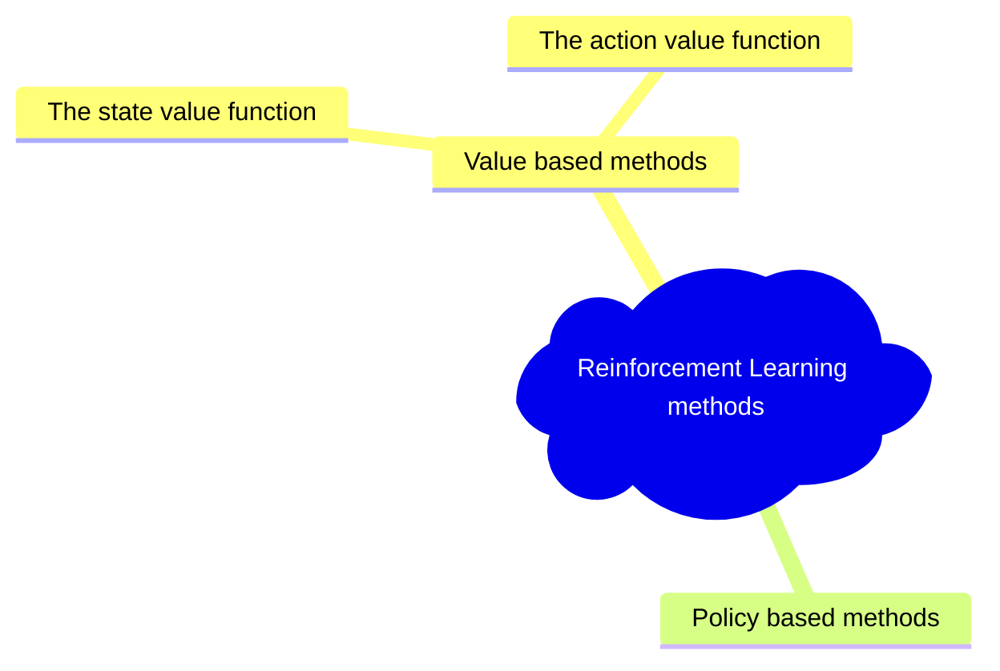

# 목표
- Value-based methods 와 Q-Learning을 중심으로 진행함
- Q-Learning Agent를 처음부터 implementation할 것임
- Agent는 두가지 환경에서 학습 시킬 것임
	- Frozen-Lake-v1 (non-slippery version) : 특정 state(s)에서 goal state(g)로 감. 이 과정에서, Fronzen tile(F)로 걷고, 구멍(H)는 피함(아래 그림 중 우측)
	- An autonomous taxi: 도시를 누비며 승객을 A 지점에서 B 지점까지 태워다 주는 환경
- Monte Carlo와 Temporal Difference Learning(TD)의 차이를 배우게 됨

# Overview

![[envs.gif]]
# Two types of value-based methods
> [!tldr] state-value, action-value function
> policy based method는 곧바로 policy를 학습시켜, 주어진 state에서 행할 action을 알려주게 됨. 이와는 달리, value-based method는 한 state 또는 한 state와 첫 action을 행한 후, 기 정의한 policy를 따라 action을 취한다. 이 policy를 따라 진행했을 때 얻어지는 보상을 할인한 값이 해당 state 또는 state,action의 value가 됨

Value-based methods 에서는 각 ==state에 대한 할인 기대 보상(expected discounted return)의 mapping function을 학습== 시키게 됨. 이 mapping function을 *==Value function==* 이라 함
![[Pasted image 20231015201408.png]]

어떤 state의 <u>할인 기대 보상</u>은 agent가 ==특정 state에서 시작해 Policy에 따라 행동할때 얻는 보상을 뜻함==.

> [!question] Value-based에서 policy란?
> 위 문장에서 "Policy를 따라" 라고 했지만, value-based에서는 value function을 학습시킴. 따라서 여기서 Policy란 무엇인가

RL Agent의 목표는 Optimal Policy $\pi^{*}$를 ==소유하는 것임==

Optimal Policy를 찾는 방법은 두가지가 있음
- [[Unit1 - Introduction to Deep Reinforcement Learning#Policy-Based Methods | Policy based method]] : state에서 취해야할 **==action을 바로 학습==** 시킴. 이때 value function은 없음
![[Pasted image 20231015202723.png]]
	-  따라서 우리가 Policy를 지정하는 것이 아닌 **==학습을 통해 Policy를 정의하게 됨==**

- [[Unit1 - Introduction to Deep Reinforcement Learning#Value-based method | Value based method]] : Value function은 state또는 state-action pair의 value를 내보냄. Value function을 기준으로 policy가 행동을 취함
	- Policy를 학습시키는 것이 아니기 때문에, ==Policy에 해당하는 행동==을 정의해야함
	- 예를 들어 항상 가장 큰 보상 방향으로 행동하려면 **==Greedy Policy==** 로 할 수 있음
![[Pasted image 20231015203810.png]]

어떤 경우에도 ==Policy는 가지게 됨==. Value-based에서 policy는 미리 정의한 간단한 function임

## Policy와 Value-baesd의 차이점
다시 쓰면 이 둘의 차이점은 다음과 같음
- ==Policy-baesd== : Optimal policy($\pi^{*}$)는 학습을 통해 바로 찾게 됨
- ==Value-based== : optimal value function($Q^{*},V^{*}$)을 찾는 것이 optimal policy를 찾게 해줌
![[Pasted image 20231015205545.png]]
> [!question] Value와 Policy는 밀접한 관계로 보임
> Policy를 어떻게 정햐느냐 따라 한 state의 value도 정의가 달라질 것 같음.

보통은 **==Epsilon-Greedy Policy==** 를 사용해 [[Unit1 - Introduction to Deep Reinforcement Learning#Exploitation / Exploration|exploration/exploitation trade-off]]를 다루게 됨. Value-based function에는 **==두가지가 있음==**

## The state value function
![[Pasted image 20231016223712.png]]
state-value function에서는 한 state로 부터 시작해, Policy $\pi$를 계속 따라갔을 때 기대할 수 있는 값을 **==기대 보상==** 으로 정의함

만약 한 state에서 시작해, 한 step을 디딜때 마다 -1의 reward가 주어진다 할때 각 state의 value는 아래와 같이 정의 할 수 있음
![[Pasted image 20231016223844.png]]

## The action value function
Agent가 한 state에서 시작하고 첫 action을 취한 뒤 Policy $\pi$를 따라 행동했을 때 기대할 수 있는 보상을 기대 보상으로 정의하게 됨
![[Pasted image 20231016224041.png]]
원문에서는 제대로 설명되지는 않았지만, 아마도 *==greedy action==* 을 policy로 했다면, 기대보상이 줄어드는 방향으로 움직이지 않기 때문에 아래와 같이 모든 state를 채우는 것이 아닌, 특정 state에만 value가 표시된 것으로 보임
![[Pasted image 20231016224219.png]]

## Value-based function의 문제점
Value-based function의 기대 보상을 계산하기 위해서는 다음 state의 모든 value를 합해야하 함. 즉 이미 계산된 값을 다시 계산하는 불편함이 존재함. 이와 같은 반복 계산 문제를 해결하는 것이 [[#Bellman equation, simplify our value estimation | Bellman equation]]임

# Bellman equation, simplify our value estimation
> [!tldr] 강화학습게의 Dynamic programming
> Dynamic programming은 이미 계산된 값을 기록(memo)하고 다시 꺼내 씀으로써 계산을 줄여주는 방식이다. 이와 유사하게 bellman equation에서는 현재 state의 value를 즉시 받는 보상과, 다음 state의 value를 할인한 것으로 정의하기 때문에 훨씬 효율적인 계산이 가능하다

## 지루한 기존 방식
> 매 State에 대해 Goal 까지의 value를 매번 계산함

지금까지 방식은 한 State의 Value$V(S_t)$를 계산하기 위해서는 해당 state에서 policy를 따라 움직일때 기대보상을 다 더해야 했음(여기서 policy를 greedy라고 정의함). 이 과정을 그림으로 표현하면 아래와 같음

![[Pasted image 20231016231012.png |350]]![[Pasted image 20231016231230.png|350]]
위 그림에서 볼 수 있듯, 한 State의 Value를 계산하기 위해서는 Goal까지의 State를 Policy를 따라 움직여야 함. 그리고, $V(S_\text{t+1})$에 대해 계산할때도 마찬가지로 Goal 까지 모든 State를 Policy를 따라 움직여 계산하게 됨

## Bellman Equation을 통한 빠른 계산
$Reward = R_{\text{t+1}}+\gamma*V(S_{\text{t+1}})$ 로 정의할 수 있음
![[Pasted image 20231016234938.png]]
즉 reward를 계산하기 위해, Goal State까지의 계산을 반복하는 것이 아닌, immedate reward와 다음 state의 reward의 합을 할인한 값으로 나타냄

아래 두 그림을 통해 효율성의 차이를 볼 수 있음
![[Pasted image 20231016235050.png|350]]![[Pasted image 20231016235103.png|350]]
위의 오른쪽 경우를 식으로 다시 쓰면 아래와 같음
$V(S_t) = R_{\text{t+1}}+\gamma*V(S_{\text{t+1}})$
위에서 개념을 간단하기 위해서 $\gamma=1$로 진행함(Discount 없음)

# Study question

> [!question] 더 공부해 보기
> 1. 위 value-based function에서 보면 마치 , $S_{\text{t+1}}$이 Goal 방향으로 이어질 것처럼 그려진 것으로 보임. 만약 다음 $S_{\text{t+1}}$이 다른 방향으로 가도, 위와같은 그림이 나오는가? 아니면 일종의 greedy action이 기 정의되어 있기 때문에 신경 쓸 필요가 없는 것인가?
> 	1. 신경 쓸 필요가 없다고 하기엔 논리적 모순이 있어보임. 왜냐하면 실제 goal에 다다르기 전까지는 해당 방향이 goal에 다다르는 방향인지 알 수 없기 때문에 greedy로 정해놓았다해도 바로 해당 state의 value를 알 수 없을 것으로 보임
> 	2. 따라서 몇번의 과정을 통해 각 state를 계산하는 과정이 있을 것으로 보임. 이는 책에서도 나왔던 부분으로 기억함
> 2. [[#Bellman equation, simplify our value estimation]]에서 Study Question(Huggin face에서 주어진 질문)
> 	1. 만약 $\gamma$가 작아지거나(0,0.01) 큰것은 어떤 의미를 가지는가?
> > [!done] 
> > $\gamma$가 작다면 즉각적인 보상에 oriented된 value function이 되고, $\gamma$가 크면 Long-term reward도 고려하는 모델이 됨
> > 예) 자율주행 차. 바로 앞에서 일어나는 일을 처리하는데 orient 또는 long-term의 기대보상에 따라 움직이는 자율주행 agent

#ReinforcementLearning  #vlaue-basedFunction 