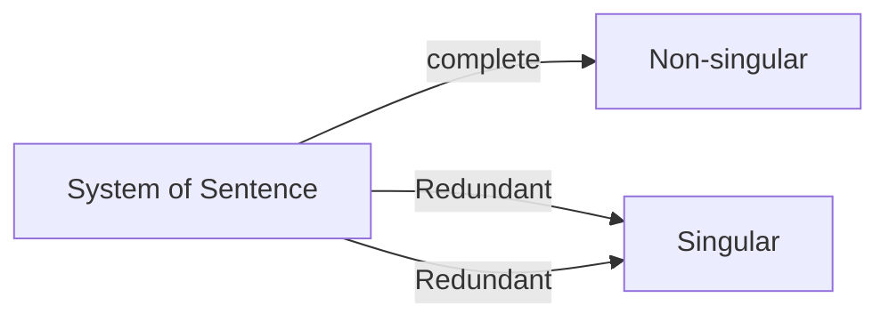

# 이 코스의 다른점
수학 뿐만 아니라 Python code도 할 것임

# Introduction
실제 상황을 Matrix로 표현하게 됨. Singularity 등
Week 2 - 2 by 2, 3by 3, Rank 등
Week 3 - Vector
Week 4 - Eigen vector

pre-requisite
- 간단한 수학 및 plot
	- 1 variable math
	- 2d plot
- Basic Algebra를 알고 있으면 됨

# System of sentences
> [!tldr] Complete / Redundant / Contradictory
> 일상적인 문장을 이용해 각 변수가 해결 가능한 문제인지 보여줌
> 해결 가능한 complete를 Non-singular
> 같은 내용이 반복되거나 모순되는 경우는 Singular case에 해당함

## Complete
- The dog(b) is black
- The cat(c) is orange
	- 위 문장은 각 변수(동물)를 계산 할 수 있음

## Redundant
- The dog is black
- The dog is black
	- 두 변수(문장)는 동일하기 때문에 문제를 풀 수 없음

## Contradictory
- The dog is black
- The dog is white
	- 두 문장은 모순됨

# System of equations
> [!tldr] Complete / Redundant / Contradict
> 문장으로 표현된 것을 식으로 표현. 그리고 이를 해결 가능한 경우 들을 확인함

## Complete
- $a+b=10$
- $a+2b=12$
	- $a=8,b=2$
	- `Non-singular`
![[01_no_single.png | 400]]

## Redundant
- $a+b=10$
- $2a+2b=20$
	- 무한히 많은 해답이 존재함
	- `Singular`
![[02_red_single.png |400]]
## Contradictory
- $a+b=10$
- $2a+2b=24$
	- 모순되기 때문에 답이 존재하지 않음
	- `Singular`
![[03_cnt_single.png | 400]]

# Linear Equation
> [!tldr] 선으로 표현 가능 한 식(2D)
> 선형 식은 좌표에 선으로 표현 가능함

# [[Week1 - Numpy part]]

#LinearAlgebra #deeplearningAI #numpy 
